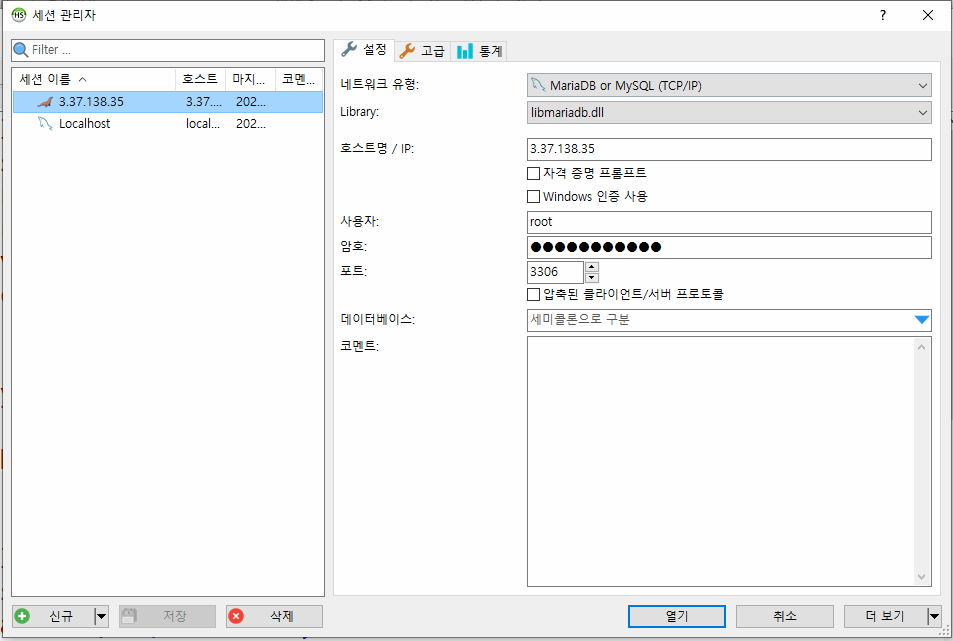

# Aws EC2 Server 설치
## Aws 콘솔에서 작업
	1. 탄력적IP 할당
	2. 할당받은 IP와 Instance연결
	3. 보안그룹에서 80, 3306포트를 모든곳에서 접근으로 설정

## 서버 프로그램 설치
```bash
# 서버 접근
ssh -i xxxx.pem ubuntu@3.37.138.35

# 접속해서 apt 프로그램 설치 관리자 upgrade
sudo apt update

# npm 설치
sudo apt install npm

# npm update
npm i -g npm

# nvm 설치
curl -o- https://raw.githubusercontent.com/nvm-sh/nvm/v0.36.0/install.sh | bash

# nvm 적용
source ~/.bashrc

# maria DB 설치
sudo apt-get install mariadb-server
```

## nvm 설정
```bash

# nvm을 이용해 lts버전 설치
nvm install --lts

# 설치된 최신의 nodejs를 사용하겠다.
nvm use --lts

```
## vi 명령어
1. **i** 를 누르면 -- insert -- 
2. **esc** 를 누르면 파일관리 설정
3. 원하는 라인에서 i를 누르고 수정한 후에
4. **esc** 를 누르고 **:wq**를 입력하면 저장(w), 빠져나오기(q) 실행
5. :q! => 저장안하고 빠져나오기(!강제옵션)
6. :wq! => 저장하고 빠져나오기(!강제옵션)

## mysql 설정
```bash
# [vi로 열기] 어디서나 접근 가능하게 보안설정 열기
sudo vi /etc/mysql/mariadb.conf.d/50-server.cnf
# bind_address 127.0.0.1 로컬에서만 접근 가능한 환경을 모든곳에서 접근 가능하게 바꿈
```

## mysql 명령
```bash
# mysql 열기
sudo mysql
```

```sql
-- mysql root사용자 접근을 비밀번호로 접근하게 바꿈
update mysql.user set plugin='mysql_native_password' where user='root'; 
flush privileges;

-- root의 패스워드를 지정
update mysql.user set authentication_string=PASSWORD('new password') where user='root';
flush privileges;

-- 어디서나(heidi)접근 가능한 root 유저 생성
grant all privileges on *.* to 'root'@'%' identified by 'new password';
flush privileges;

-- shop 사용자 생성
grant all privileges on shop.* to 'shop'@'%' identified by 'new password';
flush privileges;

-- 빠져나오기
exit
```

```bash
sudo service mysql restart
```

## 이전작업
1. git에서 clone 해오기
```bash
# git clone해오기
~/$ cd webroot
~/webroot$ git clone https://github.com/booldook/2021-sc-web-14-gbook.git

# 폴더명 바꾸기
mv 2021-sc-web-14-gbook gbook

#gbook 으로 이동
cd gbook
~/webroot/gbook$

# npm dependancy 설치
npm i

# .dotenv 만들기
vi .env

- 내용 넣고
- :wq 빠져나오고
```

2. mysql 접근



3. sql 파일을 실행
```sql
CREATE TABLE IF NOT EXISTS `users` (
  `id` int unsigned NOT NULL AUTO_INCREMENT,
  `userid` varchar(50) NOT NULL,
  `userpw` varchar(255) DEFAULT NULL,
  `username` varchar(50) DEFAULT NULL,
  `email` varchar(255) DEFAULT NULL,
  `createdAt` datetime NOT NULL DEFAULT CURRENT_TIMESTAMP,
  `expiredAt` datetime DEFAULT NULL,
  `grade` tinyint unsigned NOT NULL DEFAULT '2' COMMENT '0:탈퇴회원 1:유휴회원 2:회원 3:우수 9:관리자',
  PRIMARY KEY (`id`)
) ENGINE=InnoDB DEFAULT CHARSET=utf8mb4;


CREATE TABLE IF NOT EXISTS `gbook` (
  `id` int unsigned NOT NULL AUTO_INCREMENT,
  `content` varchar(255) NOT NULL,
  `writer` varchar(255) NOT NULL,
  `createdAt` datetime NOT NULL DEFAULT CURRENT_TIMESTAMP,
  `uid` int unsigned NOT NULL,
  PRIMARY KEY (`id`),
  KEY `uid` (`uid`),
  CONSTRAINT `FK_gbook_users` FOREIGN KEY (`uid`) REFERENCES `users` (`id`) ON DELETE CASCADE ON UPDATE CASCADE
) ENGINE=InnoDB DEFAULT CHARSET=utf8mb4;


CREATE TABLE IF NOT EXISTS `gbookfile` (
  `id` int unsigned NOT NULL AUTO_INCREMENT,
  `gid` int unsigned NOT NULL,
  `oriname` varchar(255) CHARACTER SET utf8mb4 NOT NULL,
  `savename` varchar(255) CHARACTER SET utf8mb4 NOT NULL,
  `createdAt` datetime NOT NULL DEFAULT CURRENT_TIMESTAMP,
  `size` int unsigned NOT NULL,
  `type` varchar(255) CHARACTER SET utf8mb4 NOT NULL,
  PRIMARY KEY (`id`) USING BTREE,
  KEY `pid` (`gid`) USING BTREE,
  CONSTRAINT `FK_gbookfile_gbook` FOREIGN KEY (`gid`) REFERENCES `gbook` (`id`) ON DELETE CASCADE ON UPDATE CASCADE
) ENGINE=InnoDB AUTO_INCREMENT=22 DEFAULT CHARSET=utf8mb4  ROW_FORMAT=DYNAMIC;

```

## 실제 운영
```bash
# pm2 모듈 전역설치
sudo npm i -g pm2

# ~/webroot/gbook 이동

# pm2 시작
pm2 start app.js

# pm2 종료
pm2 kill
```
## 업데이트가 발생하면
1. git에 push를 한다.
2. 맨위에 기술된 방식으로 서버에 접속한다.
3. webroot/gbook으로 이동한다.
4. pm2 kill 로 서비스를 종료한다.
5. git pull 로 내려받는다.
6. pm2 start app.js 서비스를 다시 시작한다.
